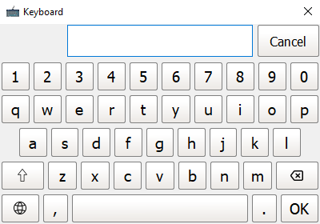
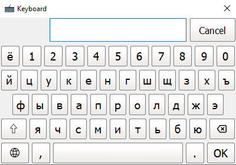

# pyqt_virtual_keyboard
Virtual keyboard based on PyQt5.





This keyboard is design for touchscreen applications on cross-platform (*Windows*, *Linux*).

Features:

- QWERTY layout.
- Resizable based on your screen sizes.
- PopUp position can be set base on your implementation and screen sizes.

Implementation:

1. Open terminal.

2. Navigate to **pyqt_virtual_keyboard** folder.

3. Install dependencies:

   ```bash
   python3 -m pip install --upgrade pip
   python3 -m pip install -r requirements.txt
   ```

4. Run example:

   ```bash
   python3 example.py
   ```

